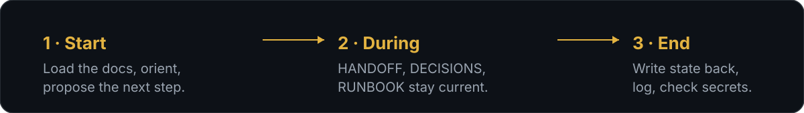
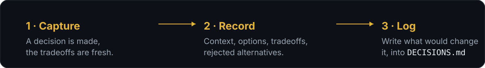
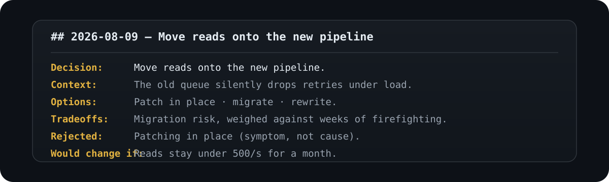
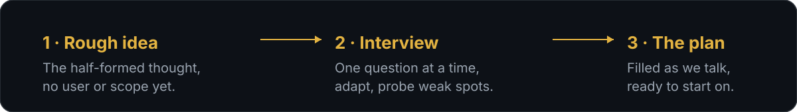

<p align="center">
  
</p>

<p align="center">
  <a href="#session-handoff"><strong>Session Handoff</strong></a> ·
  <a href="#decision-log"><strong>Decision Log</strong></a> ·
  <a href="#idea-developer"><strong>Idea Developer</strong></a> ·
  <a href="#installation"><strong>Install</strong></a> ·
  <a href="#maintaining-this-collection"><strong>Add a skill</strong></a> ·
  <a href="#license"><strong>License</strong></a>
</p>

A small, hand-maintained collection of [open agent skills](https://opencode.ai/docs/skills) I keep improving. Each one lives under a category folder in [`skills/`](skills/) and stays small enough to read in full. Drop the ones you want into your own skills directory.

Right now there are three, under `skills/continuity/` and `skills/creativity/`. That list will grow.

## Session Handoff

Sessions are ephemeral; the model and the human both forget context between them. Session Handoff keeps a tiny set of project docs so work survives. When a session starts it reads them in order, orients on where things stand, and proposes the highest-value next step. When it ends it writes current state and next actions back down, so the next session picks up cleanly instead of re-discovering everything.

<p align="center">
  
</p>

The docs it maintains:

- **`HANDOFF.md`** holds where things stand and what's next.
- **`SESSION_LOG.md`** is a running record of each session.
- **`RUNBOOK.md`** lists the commands worth not rediscovering.

Durable decisions are recorded by Decision Log, not here. It ships with `references/templates.md` (exact formats for each doc) and `references/read-order.md`.

## Decision Log

The "why" of a choice is the part that doesn't survive on its own. The what lives in code and config; the reasoning evaporates. Decision Log writes it down at the moment the call is made, so three months later nobody has to re-litigate an architecture debate because the tradeoffs were never captured.

<p align="center">
  
</p>

It records the context, the options considered, the accepted tradeoffs, the rejected alternatives, and the condition that would flip the call, into `docs/DECISIONS.md`. When a decision is revisited it reads the old entry first, so the new debate starts from the recorded reasoning instead of from scratch. It ships with `references/templates.md` for the entry format.

<p align="center">
  
</p>

Session Handoff hands decision capture over to this skill rather than owning it itself.

## Idea Developer

A rough idea is not a plan. Idea Developer takes the half-formed tech or product thought and interviews it into a one-page plan. It asks one question at a time, adapts to whatever the user just said, and probes the weak spots: an audience of "everyone", a differentiator of "it's just better", a scope that quietly covers three products. After five to ten questions it hands back a filled template with a one-liner, problem, audience, solution, differentiators, MVP scope, risks, and next actions. The template fills as the conversation runs, so the plan is already written by the time the interview ends.

<p align="center">
  
</p>

It ships with `references/questions.md`, the question bank organized by theme, each section carrying a probe that names the weak spot to push on.

## Installation

Install every skill in this repo:

```
npx skills add pkhamre/skills
```

Or add a single one:

```
npx skills add pkhamre/skills --skill session-handoff
npx skills add pkhamre/skills --skill decision-log
npx skills add pkhamre/skills --skill idea-developer
```

## Maintaining this collection

Adding a skill means creating `skills/<category>/<name>/SKILL.md` with a `name` and `description` in the frontmatter, plus any bundled `references/`, `scripts/`, or `assets/` it needs. The description is what makes it trigger, so it should say both what the skill does and when to reach for it. Keep the body under a few hundred lines and push detail into reference files. See [opencode's skill docs](https://opencode.ai/docs/skills) for the layout.

Installed upstream skills and the opencode install manifest aren't tracked here. Authored skills are the contents of `skills/`.

## License

MIT. See [LICENSE](LICENSE).
