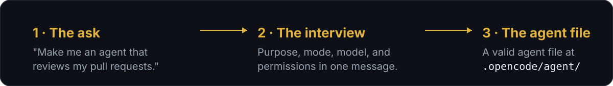
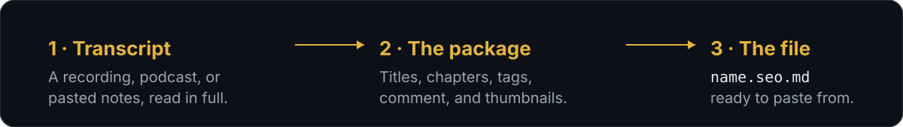

<p align="center">
  
</p>

<p align="center">
  <a href="#session-handoff"><strong>Session Handoff</strong></a> ·
  <a href="#decision-log"><strong>Decision Log</strong></a> ·
  <a href="#idea-developer"><strong>Idea Developer</strong></a> ·
  <a href="#agent-creator"><strong>Agent Creator</strong></a> ·
  <a href="#youtube-seo"><strong>YouTube SEO</strong></a> ·
  <a href="#installation"><strong>Install</strong></a> ·
  <a href="#maintaining-this-collection"><strong>Add a skill</strong></a> ·
  <a href="#license"><strong>License</strong></a>
</p>

A small, hand-maintained collection of [open agent skills](https://opencode.ai/docs/skills) I keep improving. Each one lives under a category folder in [`skills/`](skills/) and stays small enough to read in full. Drop the ones you want into your own skills directory.

Right now there are five, under `skills/continuity/`, `skills/creativity/`, `skills/content/`, and `skills/opencode/`. That list will grow.

## Session Handoff

Sessions are ephemeral; the model and the human both forget context between them. Session Handoff keeps a tiny set of project docs so work survives. When a session starts it reads them in order, orients on where things stand, and proposes the highest-value next step. When it ends it writes current state and next actions back down, so the next session picks up cleanly instead of re-discovering everything.

<p align="center">
  
</p>

The docs it maintains:

- **`HANDOFF.md`** holds where things stand and what's next.
- **`SESSION_LOG.md`** is a running record of each session.
- **`RUNBOOK.md`** lists the commands worth not rediscovering.

Durable decisions are recorded by Decision Log, not here. It ships with `references/templates.md` (exact formats for each doc) and `references/read-order.md`.

## Decision Log

The "why" of a choice is the part that doesn't survive on its own. The what lives in code and config; the reasoning evaporates. Decision Log writes it down at the moment the call is made, so three months later nobody has to re-litigate an architecture debate because the tradeoffs were never captured.

<p align="center">
  
</p>

It records the context, the options considered, the accepted tradeoffs, the rejected alternatives, and the condition that would flip the call, into `docs/DECISIONS.md`. When a decision is revisited it reads the old entry first, so the new debate starts from the recorded reasoning instead of from scratch. It ships with `references/templates.md` for the entry format.

<p align="center">
  
</p>

Session Handoff hands decision capture over to this skill rather than owning it itself.

## Idea Developer

A rough idea is not a plan. Idea Developer takes the half-formed tech or product thought and interviews it into a one-page plan. It asks one question at a time, adapts to whatever the user just said, and probes the weak spots: an audience of "everyone", a differentiator of "it's just better", a scope that quietly covers three products. After five to ten questions it hands back a filled template with a one-liner, problem, audience, solution, differentiators, MVP scope, risks, and next actions. The template fills as the conversation runs, so the plan is already written by the time the interview ends.

<p align="center">
  
</p>

It ships with `references/questions.md`, the question bank organized by theme, each section carrying a probe that names the weak spot to push on.

## Agent Creator

Agents are just files with a strict shape: a YAML frontmatter from a fixed field list, and a body that becomes the prompt. The user thinks in plain language, the skill thinks in schema. Agent Creator turns a request like "I need an agent that reviews my pull requests" into a working `.opencode/agent/<name>.md`. It interviews briefly for purpose, mode, model, and permissions, writes a valid definition to the right scope, and reminds you to restart opencode, which loads config at startup and ignores new agents until then.

<p align="center">
  
</p>

It ships with `references/agent-format.md`, the exact file format: locations, the allowed frontmatter fields, how permission rules behave, and worked examples.

## YouTube SEO

Publishing a video is easy; making it findable is not. YouTube SEO takes a transcript, a podcast recording, or plain spoken-word notes and turns it into the full upload package: three title options, a search-optimized description with chapter timestamps, comma-separated tags that stay inside YouTube's limits, a pinned comment meant to draw replies, and thumbnail suggestions, all saved as one markdown file you can copy sections from while uploading. It reads the whole transcript before deciding anything, looks through the repo for your past transcripts and channel voice so the copy stays consistent, and asks only for what it can't find. When a transcript has no timecodes it estimates the chapter boundaries and marks every timestamp as approximate so you can verify before publishing. The copy stays conservative and honest, and it leans on the anti-ai-slop-writing skill when one is around.

<p align="center">
  
</p>

It ships with `references/youtube-platform-limits.md`, the title, description, tag, and chapter constraints that keep the output paste-ready.

## Installation

Install every skill in this repo:

```
npx skills add pkhamre/skills
```

The skills are grouped by category. Install only one category by pointing the
command at that category's directory:

```text
continuity  Session Handoff, Decision Log
creativity  Idea Developer
content     YouTube SEO
opencode    Agent Creator
```

```bash
npx skills add https://github.com/pkhamre/skills/tree/main/skills/continuity --all
npx skills add https://github.com/pkhamre/skills/tree/main/skills/creativity --all
npx skills add https://github.com/pkhamre/skills/tree/main/skills/content --all
npx skills add https://github.com/pkhamre/skills/tree/main/skills/opencode --all
```

To browse the skills that a source exposes before installing:

```bash
npx skills add pkhamre/skills --list
```

Or add a single skill:

```
npx skills add pkhamre/skills --skill session-handoff
npx skills add pkhamre/skills --skill decision-log
npx skills add pkhamre/skills --skill idea-developer
npx skills add pkhamre/skills --skill agent-creator
npx skills add pkhamre/skills --skill youtube-seo
```

## Maintaining this collection

Adding a skill means creating `skills/<category>/<name>/SKILL.md` with a `name` and `description` in the frontmatter, plus any bundled `references/`, `scripts/`, or `assets/` it needs. `npx skills add` discovers this two-level catalog layout, so keep the category meaningful and stable. The description is what makes it trigger, so it should say both what the skill does and when to reach for it. Keep the body under a few hundred lines and push detail into reference files. See [opencode's skill docs](https://opencode.ai/docs/skills) for the layout.

Installed upstream skills and the opencode install manifest aren't tracked here. Authored skills are the contents of `skills/`.

## License

MIT. See [LICENSE](LICENSE).
